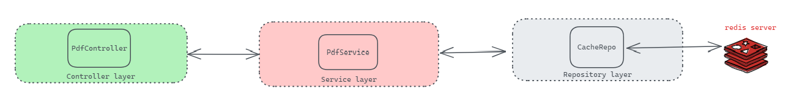

# PDF Springboot REST

## Notes:

1. To optimise the endpoint, we are caching following key:value pair
```
{ 
    key => Serialized Request Invoice object JSON
    value => Base64 encoded byte[] Array representing .pdf file
}
```
2. Non-cached invoice request takes **236 ms** while cached takes only **9 ms**

## Setup:
1. To test on local machine, start redis server using `redis-server` (default port)

## API
url: http://localhost:8082/
|METHOD|endpoint|required params|content-type|
|---|------------------------------------|---|---|
|POST |`/api/v1/pdf`|None|`application/json`|

###### Example request JSON
```--data-raw 
{
"seller": "XYZ Pvt. Ltd.",
"sellerGstin": "29AABBCCDD121ZD", 
"sellerAddress": "New Delhi, India", 
"buyer": "Vedant Computers",
"buyerGstin": "29AABBCCDD131ZD",
"buyerAddress": "New Delhi, India", 
"items": [
    {
    "name": "Product 1", 
    "quantity": "12 Nos", 
    "rate": 123.00,
    "amount": 1476.00 
    }
] 
}
```

##### TODO:
1. test cases for service and repo layer
2. exception handling